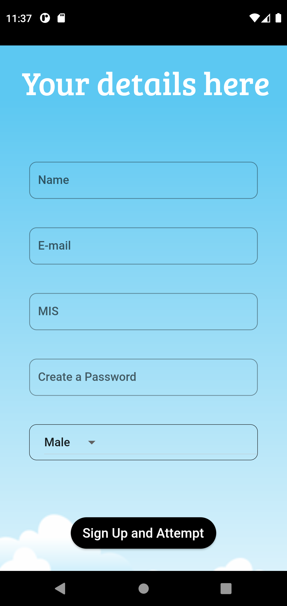
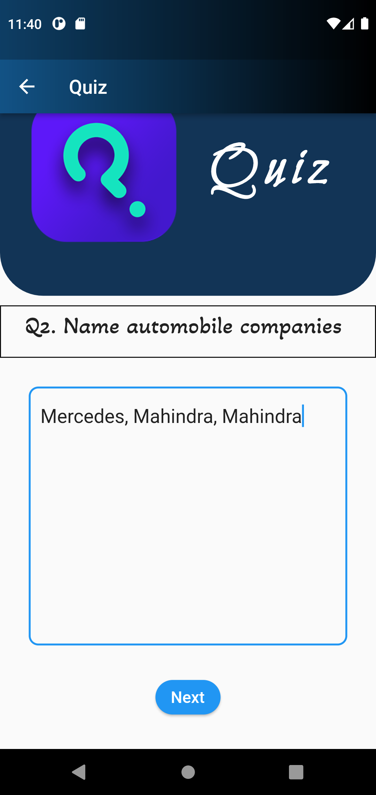
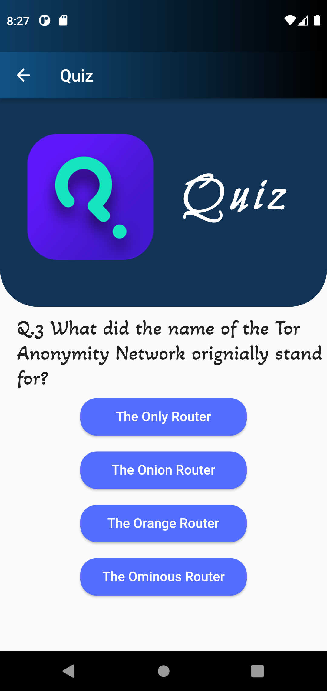
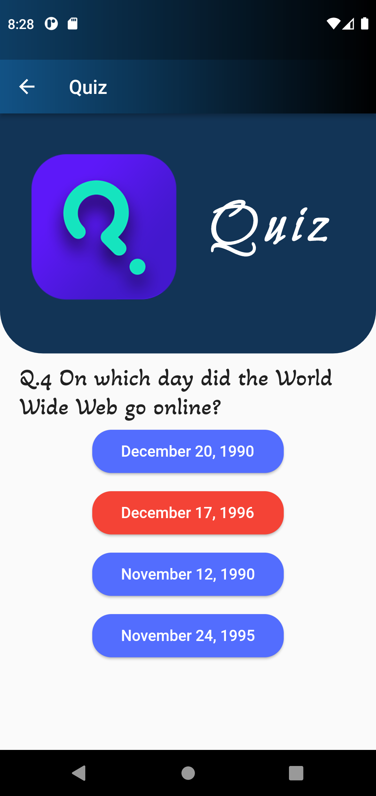
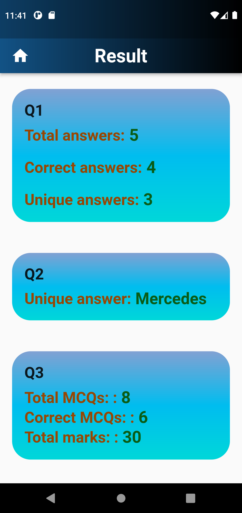

# Quiz_app
A quiz app to be used for study of psychology of students with a given set of
questions. Mapping out indices such as fluency, flexibility, uniqueness and elaboration from the questions.
More questions to be included soon.
This project was created as a **mini project** for the course Principles of Programming Languages


## Screenshots

Sign In                    |  Sign Up                  |  Password reset link
:-------------------------:|:-------------------------:|:-------------------------:
 |  | 

Question 1                   |  Question 2                  |  Question 3-10
:-------------------------:|:-------------------------:|:-------------------------:
 |  | 

If correct                 |  If wrong                 |  Result page
:-------------------------:|:-------------------------:|:-------------------------:
 |  | 


## Installation

Clone the repository

```
git clone https://github.com/rohit-00004/quiz.git
```

Change directory
```
cd quiz
```
Run this to get all dependencies
```
flutter pub get
```
Make sure you have an emulator already setup and selected, run the project as
```
flutter run 
```
Press q to exit 


    
## Tech used 

- Flutter for frontend
- Firebase in backend


## Firebase features 🚀

- Sign In and Sign Up methods
- Email/password authentication
- Password reset link
- Firestore for storing user details and user result 
## Acknowledgements

 - [Illustration image used](https://www.freepik.com/free-vector/questions-concept-illustration_7191139.htm)
 
